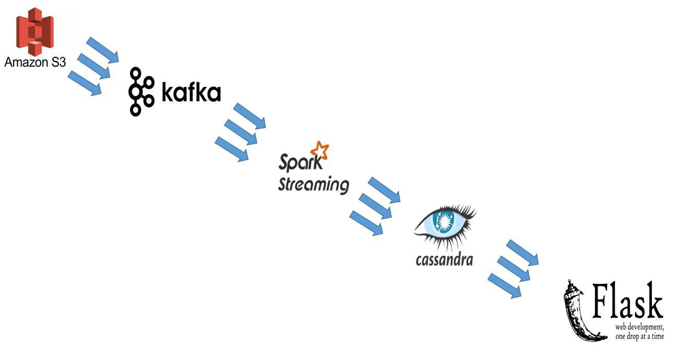

# SmartMoneyTracker

### Project Idea 
An open-source data pipeline to analyze and visualize abnormal events and notify users in real-time.

### What is the purpose, and most common use cases?
Options are one of the most versatile trading instruments, which offer a high-leverage approach to trading. For instance, you can construct a zero dollar option trade by selling calls and buying puts at the right strikes to effectively achieve [infinite leverage]. However, some strategies (e.g., selling unprotected options) could lead to unlimited risk. As a results, it is worth to follow the "smart money", which is controlled by institutional investors, market mavens and other financial professionals. 
 * `Use case`: Detect unusual options activity (e.g., abnormal volume) in realtime (for short term traders), and end-of-day review and analysis:

  identify the biggest change in open interest for equity options and new trades made by major players, which provide insights for swing trades.

### Which technologies are well-suited to solve those challenges? 
 * Options transaction flow data handling requirement: high-throughput, low-latency platform for handling real-time data feeds. 
   * Proposed solution: Kafka + Flink

### What are the primary engineering challenges? Why would a Data Engineering Hiring Manager care about this project?
 * Learn and understand a number of new tools/platforms in a three weeks, as well as be able to employ them to solve a real world problem.

### Proposed architecture

### What are the (quantitative) specifications/constraints for this project?
 * Methods used to unusual options activity are based on Donoho, Steve. "Early detection of insider trading in option markets." Proceedings of the tenth ACM SIGKDD international conference on Knowledge discovery and data mining. ACM, 2004.
   * High Option Volume
   * Call-Put Imbalance
   * Buy or Sell Detection 
   * Jump of Implied Volatility (IV)

### DEMO URL
http://ec2-54-70-255-243.us-west-2.compute.amazonaws.com/

[infinite leverage]: <https://www.quora.com/How-much-leverage-can-I-expect-from-an-options-trade>
