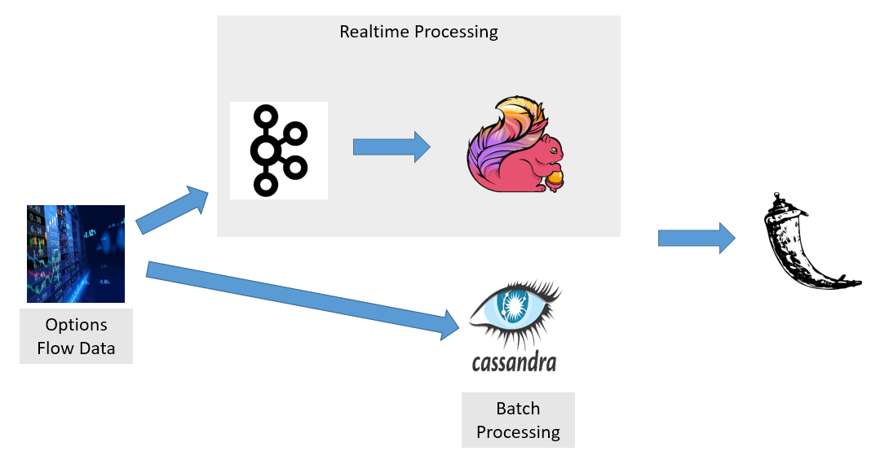

# SmartMoneyTracker

### Project Idea 
An open-source data pipeline to analyze and visualize abnormal events and notify users in real-time.

### What is the purpose, and most common use cases?
Options are one of the most versatile trading instruments, which offer a high-leverage approach to trading. For instance, you can construct a zero dollar option trade by selling calls and buying puts at the right strikes to effectively achieve [infinite leverage]. However, some strategies (e.g., selling unprotected options) could lead to unlimited risk. As a results, it is worth to follow the "smart money", which is controlled by institutional investors, market mavens and other financial professionals. 
 1. `Use case 1`: Detect unusual options activity (e.g., abnormal volume) in realtime, and provide suggestions for short-term trades.
 2. `Use case 2`: End-of-day review and analysis: identify the biggest change in open interest for equity options and new trades made by major players, which provide insights for swing trades.
 3. `Use case 3`: U.S. Securities and Exchange Commission (SEC) can use this approach to identify inside trading.

### Which technologies are well-suited to solve those challenges? 
Options transaction flow data handling requirement: high-throughput, low-latency platform for handling real-time data feeds.
Proposed solution: Kafka + Flink

### Proposed architecture

[infinite leverage]: <https://www.quora.com/How-much-leverage-can-I-expect-from-an-options-trade>
